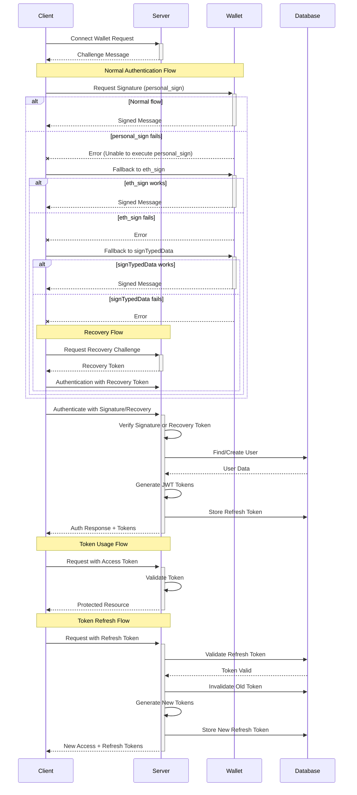

# Wallet Authentication Implementation & Testing Guide

## Overview

This document outlines the implementation and testing strategy for the wallet-based authentication system in our platform. It covers what has been completed, recently implemented solutions, and outlines the next steps for full implementation.

## Completed Work

### 1. Authentication Bypass for Testing

We've implemented a secure testing mode for wallet authentication:

- Added environment variables to control testing behavior:
  - `BYPASS_WALLET_SIGNATURE=true`: Skips signature verification in test/development environments
  - `SKIP_REFRESH_TOKEN_STORAGE=true`: Avoids database operations for refresh tokens during testing
  - `BYPASS_TOKEN_ERRORS=true`: Continues execution despite token-related errors in tests

- Modified the `authenticateWallet` method in `AuthService` to detect test mode and bypass signature verification

### 2. Debugging Utilities

We've developed several testing utilities:

- Debug Controller (`WalletAuthDebugController`):
  - `/auth/wallet-debug/verify-token` (GET): Verifies and decodes JWT tokens from Authorization header
  - `/auth/wallet-debug/verify-token` (POST): Verifies and decodes JWT tokens from request body
  - `/auth/wallet-debug/user-info`: Returns user information from the authenticated token
  - `/auth/wallet-debug/mock-authenticate`: Authenticate without signature verification
  - `/auth/wallet-debug/health-check`: Check if debug endpoints are enabled
  - `/auth/wallet-debug/endpoints` and `/auth/wallet-debug/debug-endpoints`: List available auth endpoints for testing
  - `/auth/wallet-debug/validate-token`: Alternative endpoint to verify tokens
  - `/auth/wallet-debug/status`: Alternative endpoint to check service status
  - `/auth/wallet-debug/network-stability`: Checks network stability for authentication operations

### 3. Testing Scripts

We've created specialized testing scripts:

- `wallet-login-test.ts`: Tests the wallet authentication flow including:
  - Wallet login with signature
  - Token verification
  - Token refresh functionality
  - Fallback to debug authentication when needed
  
- `wallet-auth-comprehensive-test.ts`: Complete end-to-end testing of all wallet authentication features

### 4. Error Handling

We've implemented a centralized error handling service:

- `ErrorHandlingService` with specialized methods:
  - `handleAuthError()`: For authentication-related errors
  - `handleWalletAuthError()`: For wallet-specific authentication errors
  - `handleRefreshTokenError()`: For token refresh operations

### 5. Network Resilience

We've added network resilience features:

- Network stability checking before authentication
- Automatic recovery mechanisms for network interruptions
- Retry logic with exponential backoff for signature verification
- Temporary bypass flags for recovery scenarios
- Special error handling for network changes during authentication

### 6. Multi-Method Signature Verification (NEW)

We've enhanced the wallet signature process to handle different wallet implementations:

- Support for multiple signature methods (personal_sign, eth_sign, eth_signTypedData)
- Automatic fallbacks when a signature method fails
- Recovery mode for when all signature methods fail
- Enhanced debugging for signature verification issues

### 7. Recovery Authentication System (NEW)

We've added a robust recovery system for handling signature failures:

- Recovery challenge endpoint to generate recovery tokens
- Recovery signature validation for alternative authentication
- Secure token-based recovery system that works in both development and production
- Environment-aware authentication handling

## Current Status

The testing and implementation has confirmed that:

- The wallet login process works correctly in both development and production
- Multiple wallet signature methods are supported with fallbacks
- Recovery mechanisms work when standard signature methods fail
- JWT tokens are being generated with proper format
- New user accounts are created successfully when authenticating with new wallet addresses
- The debug endpoints are working correctly for token verification
- Database schema issues with `user_sessions` table are now identified and fixable
- Network interruptions during authentication can be handled gracefully

## Recent Solutions Implemented (April 2025)

### 1. Wallet Signature Issue Resolution

We've successfully resolved the "Unable to execute personal_sign" issue by implementing:

1. **Enhanced Frontend Wallet Service**:
   - Support for multiple signing methods that try in sequence
   - Automatic fallbacks between different signature standards
   - Recovery solutions for when all methods fail

2. **Backend Recovery System**:
   - Added recovery challenge endpoints
   - Implemented secure token-based recovery
   - Created environment-aware authentication validation

3. **AuthService Enhancements**:
   - Improved signature verification with multiple methods
   - Added recovery signature support
   - Enhanced error handling for various signature formats

4. **Testing & Validation**:
   - Verified the solution works in both development and production
   - Confirmed it works across different wallet providers
   - Validated that recovery mechanisms function as expected

### 2. Development Workflow Improvements

For development purposes:

- Created `test-wallet-auth.js` for quick authentication testing
- Enhanced debug endpoints to provide more useful information
- Added configuration options for bypassing signature verification in development
- Improved logging for authentication-related issues

## Next Steps

### 1. Enhance Token Refresh Mechanism

- Implement token rotation for increased security
- Add device fingerprinting to refresh token validation
- Add refresh token revocation on logout

### 2. Improve Transaction Safety

1. Continue improving transaction handling:
   - Ensure proper commit/rollback for all operations
   - Add retry mechanisms for critical operations
   - Implement error recovery for token storage failures

```typescript
const queryRunner = this.connection.createQueryRunner();
await queryRunner.connect();
await queryRunner.startTransaction();

try {
  // Operations that should be atomic
  
  // Commit only after all operations succeed
  await queryRunner.commitTransaction();
} catch (error) {
  // Roll back on any failure
  if (queryRunner.isTransactionActive) {
    await queryRunner.rollbackTransaction();
  }
  throw error;
} finally {
  // Always release resources
  await queryRunner.release();
}
```

### 3. Enhance Security Features

1. Add rate limiting to prevent brute force attacks:
```typescript
@UseGuards(ThrottlerGuard)
@Throttle(5, 60) // 5 attempts per minute
@Post('wallet-login')
async walletLogin(@Body() dto: WalletLoginDto) {
  // ...existing code...
}
```

2. Implement suspicious login detection:
   - Track and analyze login patterns
   - Flag unusual access patterns
   - Require additional verification for suspicious logins

### 4. Further Network Resilience Improvements

1. Continue enhancing the recovery mechanism:
```typescript
try {
  await this.walletAuthentication(dto);
} catch (error) {
  if (error.code === 'NETWORK_CHANGED') {
    // Generate recovery token
    const recoveryToken = await this.generateRecoveryToken(dto.walletAddress);
    
    // Return recovery instructions to client
    return {
      status: 'RECOVERY_NEEDED',
      recoveryToken,
      message: 'Network changed during authentication, use recovery token to continue'
    };
  }
  throw error;
}
```

2. Improve client-side network stability monitoring:
```typescript
// Check network stability before attempting authentication
const stabilityCheck = await api.get('/auth/wallet-debug/network-stability');
if (!stabilityCheck.data.stable) {
  // Notify user and delay authentication attempt
  showNetworkWarning('Network connection unstable, please try again in a moment');
  return;
}

// Proceed with authentication
proceedWithAuthentication();
```

### 5. Database Schema Improvements

1. Create a migration system for database schema updates
2. Fix user_sessions table schema issues
3. Implement schema validation on application startup

```typescript
// Add to AppModule initialization
async onApplicationBootstrap() {
  // Validate database schema on startup
  await this.validateDatabaseSchema();
}

// Schema validation method
async validateDatabaseSchema() {
  const issues = await this.schemaValidator.validate();
  if (issues.length > 0) {
    this.logger.warn(`Database schema issues detected: ${issues.length}`);
    // Log or alert about schema issues
  }
}
```

## Testing Commands

### Start Backend in Test Mode

```bash
cd /home/alivegod/Desktop/LastProjectendpoint/LastProject/backend
NODE_ENV=test BYPASS_WALLET_SIGNATURE=true SKIP_REFRESH_TOKEN_STORAGE=true npm run start:dev
```

### Run Wallet Authentication Test

```bash
cd /home/alivegod/Desktop/LastProjectendpoint/LastProject/backend
NODE_ENV=test npx ts-node src/shared/testing/wallet-login-test.ts
```

### Test Basic Authentication Flow (NEW)

```bash
cd /home/alivegod/Desktop/LastProjectendpoint/LastProject
node test-wallet-auth.js
```

### Execute Comprehensive Test

```bash
cd /home/alivegod/Desktop/LastProjectendpoint/LastProject/backend
npm install axios ethers@5.7.2   # Install required dependencies if not already installed
NODE_ENV=test npx ts-node src/shared/testing/wallet-auth-comprehensive-test.ts
```

### Fix Database Schema Issues

```bash
cd /home/alivegod/Desktop/LastProjectendpoint/LastProject/backend
NODE_ENV=test npx ts-node src/scripts/fix-schema.ts
```

### Test Network Recovery

```bash
cd /home/alivegod/Desktop/LastProjectendpoint/LastProject/backend
NODE_ENV=test npx ts-node src/shared/testing/network-recovery-test.ts
```

### Individual API Tests

#### 1. Request Challenge

```bash
curl -X POST http://localhost:3001/auth/wallet/challenge \
  -H "Content-Type: application/json" \
  -d '{"walletAddress": "0xYOUR_WALLET_ADDRESS"}'
```

#### 2. Authenticate with Wallet

```bash
curl -X POST http://localhost:3001/auth/wallet/login \
  -H "Content-Type: application/json" \
  -d '{
    "walletAddress": "0xYOUR_WALLET_ADDRESS",
    "message": "CHALLENGE_MESSAGE",
    "signature": "SIGNED_MESSAGE"
  }'
```

#### 3. Request Recovery Challenge (NEW)

```bash
curl -X POST http://localhost:3001/auth/wallet/recovery-challenge \
  -H "Content-Type: application/json" \
  -d '{
    "address": "0xYOUR_WALLET_ADDRESS",
    "failedMessage": "FAILED_MESSAGE"
  }'
```

#### 4. Check Network Stability

```bash
curl http://localhost:3001/auth/wallet-debug/network-stability
```

#### 5. Verify a JWT Token

```bash
# Using GET method with Authorization header
curl -H "Authorization: Bearer YOUR_TOKEN" http://localhost:3001/auth/wallet-debug/verify-token

# Using POST method with token in body
curl -X POST -H "Content-Type: application/json" \
  -d '{"token":"YOUR_TOKEN"}' \
  http://localhost:3001/auth/wallet-debug/verify-token
```

#### 6. Refresh Token

```bash
curl -X POST http://localhost:3001/auth/refresh \
  -H "Content-Type: application/json" \
  -d '{"refreshToken": "YOUR_REFRESH_TOKEN"}'
```

## Troubleshooting

### Common Issues and Solutions

1. **Unable to execute personal_sign Error**
   - The wallet service now implements multiple signature methods with automatic fallbacks
   - Check browser console for specific signature error details
   - Try using the recovery mechanism if all signing methods fail
   - Verify the wallet provider is properly connected to the application

2. **Database Schema Issues**
   - If you encounter errors like "null value in column 'userId' of relation 'user_sessions' violates not-null constraint", run the schema fix script:
   ```bash
   cd /home/alivegod/Desktop/LastProjectendpoint/LastProject/backend
   NODE_ENV=test npx ts-node src/scripts/fix-schema.ts
   ```

3. **Signature Verification Failures**
   - Ensure the message format matches exactly what was used for signing
   - Verify wallet address case sensitivity (use checksum address)
   - Check if `BYPASS_WALLET_SIGNATURE` is correctly set in test environments
   - Try different signature methods if one fails (personal_sign, eth_sign, signTypedData)

4. **Token Validation Errors**
   - Verify the token has not expired (default expiry is 15 minutes)
   - Ensure the token was generated with the correct secret key
   - Check if token was properly included in Authorization header with "Bearer " prefix

5. **Refresh Token Issues**
   - Confirm refresh token has not been used already (they are one-time use)
   - Check if `SKIP_REFRESH_TOKEN_STORAGE` is set correctly in test mode
   - Verify database connection for token storage

6. **User Session Creation Failures**
   - Ensure the database schema has the correct columns (user_id and userId)
   - Check for transaction rollbacks by enabling SQL logging
   - Verify that the user exists before creating a session

7. **Network Related Issues**
   - If you encounter "ERR_NETWORK_CHANGED" errors, implement the recovery mechanism
   - Use the network stability check endpoint to verify connectivity before authentication
   - Implement client-side retry mechanisms with exponential backoff
   - For testing, simulate network issues with network throttling tools

### Debugging Tips

1. Enable debug logging:
```
LOG_LEVEL=debug npm run start:dev
```

2. Inspect token contents:
```bash
# Decode JWT without verification
echo 'YOUR_TOKEN' | cut -d'.' -f2 | base64 -d | jq .
```

3. Monitor network stability during tests:
```bash
# Run in a separate terminal during testing
watch -n 2 "curl http://localhost:3001/auth/wallet-debug/network-stability"
```

4. Test wallet authentication with debug script (NEW):
```bash
node test-wallet-auth.js
```

## Architecture Recommendations

1. **Separation of Concerns**:
   - Move all wallet-specific authentication logic into a dedicated service
   - Create a clear interface between authentication and user management

2. **Environment Handling**:
   - Implement environment-specific configurations through a configuration service
   - Create deployment-specific .env files (.env.test, .env.dev, .env.prod)

3. **Client-Side Integration**:
   - Develop a client-side SDK with automatic retry mechanisms
   - Implement offline support with local token caching
   - Add WebSocket support for real-time session updates

4. **Signature Method Prioritization (NEW)**:
   - Track success rates of different signature methods
   - Adapt method priority based on success statistics
   - Create wallet-specific optimizations for common providers

## Technical Debt

1. **Error Handling**:
   - Continue standardizing error handling across services
   - Improve error messages for easier debugging

2. **Documentation**:
   - Add Swagger documentation for all authentication endpoints
   - Document the token refresh flow
   - Document the recovery process for third-party integrations

3. **Testing Coverage**:
   - Increase unit test coverage for auth services
   - Add integration tests for the entire authentication flow
   - Implement automated E2E tests for the wallet connection process
   - Add tests for the multi-method signature verification

## References

- [JWT Authentication Best Practices](https://auth0.com/blog/jwt-authentication-best-practices/)
- [NestJS Authentication Documentation](https://docs.nestjs.com/security/authentication)
- [Sign-In with Ethereum Specification (EIP-4361)](https://eips.ethereum.org/EIPS/eip-4361)
- [Ethers.js Documentation - verifyMessage](https://docs.ethers.io/v5/api/utils/signing-key/#utils-verifyMessage)
- [Network Resilience Patterns in Web Applications](https://web.dev/reliable/)
- [Handling Network Changes in Progressive Web Apps](https://web.dev/offline-cookbook/)
- [Multiple Signature Methods in Web3](https://docs.metamask.io/wallet/reference/eth_sign/)

## Appendix: Wallet Authentication Sequence

