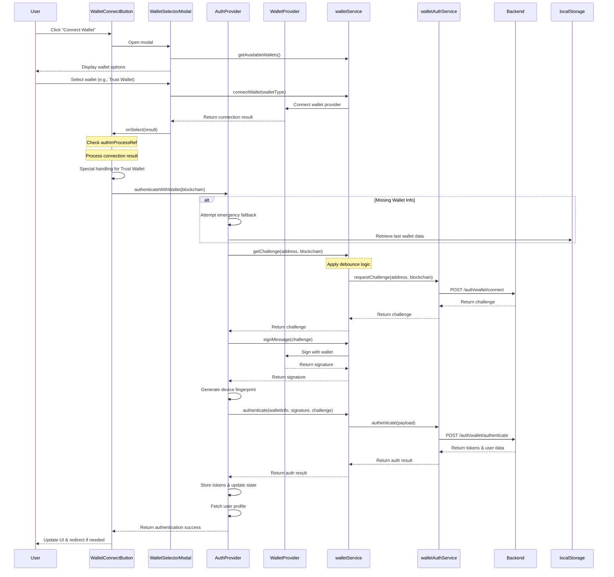

# Frontend Authentication Flow Documentation

This document describes the authentication flow in the frontend application, specifically focusing on wallet-based authentication.

## Core Files Structure

The authentication system is organized into several key components:

```
frontend/
├── src/
│   ├── components/
│   │   ├── WalletConnectButton.tsx         # Main UI component for wallet connection
│   │   └── wallet-selector/
│   │       ├── WalletSelectorModal.tsx      # Modal for selecting different wallet types
│   │       └── WalletSelector.tsx           # Component for displaying wallet options
│   ├── contexts/
│   │   ├── AuthProvider.tsx                # Authentication context provider
│   │   └── WalletProvider.tsx              # Wallet connection context provider
│   └── services/
│       ├── wallet/
│       │   ├── walletExtensions.ts         # Extensions for wallet functionality
│       │   ├── walletService.ts            # Core wallet functionality service
│       │   ├── walletSelector.ts           # Service for handling wallet selection
│       │   ├── walletInitialization.ts     # Initialization of wallet providers
│       │   ├── extensions/                 # Wallet extension implementations
│       │   ├── providers/                  # Wallet provider implementations
│       │   └── core/
│       │       └── walletBase.ts           # Base interfaces and types for wallet integration
│       └── api/
│           └── modules/
│               └── auth/
│                   ├── wallet-auth-service.ts   # API service for wallet authentication
│                   ├── auth-service.ts          # General authentication service
│                   └── auth-service-bridge.ts   # Bridge between auth services
```

## Authentication Flow

### 1. User Initiates Wallet Connection

The flow starts when a user clicks the "Connect Wallet" button rendered by `WalletConnectButton.tsx`:

1. The button click handler (`handleClick`) shows the wallet selector modal
2. `setModalOpen(true)` triggers the rendering of `WalletSelectorModal`

### 2. Wallet Selection

In the `WalletSelectorModal.tsx`:

1. Available wallets are fetched using `walletSelector.getAvailableWallets()`
2. When a user selects a wallet from the list, `handleSelectWallet` is called
3. `walletSelector.connectWallet(walletType)` is invoked to connect to the selected wallet
4. On successful connection, the result is passed to `onSelect` callback from `WalletConnectButton`

### 3. Wallet Connection Processing

Back in `WalletConnectButton.tsx`, the `handleWalletSelect` function:

1. Tracks active authentication with `authInProcessRef` to prevent duplicate processing
2. Processes the wallet connection result
3. For Trust Wallet, special handling is applied:
   - Forces blockchain type to Polygon (`BlockchainType.POLYGON`)
   - Checks network compatibility and attempts to switch to the correct network if needed
   - Adds extra delay for synchronization (`syncDelay`)
   - Manually syncs wallet info using `walletService.syncWalletInfo()`
   - Utilizes the `window.trustWalletFixer` if available

### 4. Authentication Process

Once the wallet is connected, the authentication begins:

1. `authenticateWithWallet(effectiveBlockchain)` is called from the `AuthProvider` context
2. The `AuthProvider.tsx` implements this in several steps:
   
   a. **Wallet Info Validation**:
      - Checks for valid wallet info
      - If missing, attempts emergency fallback using data from localStorage
      - Enables debugging through `window.walletAuthDebug` if available
   
   b. **Challenge Request**: 
      - Calls `getAuthChallenge` which uses `walletService.getChallengeWithBlockchain()`
      - This invokes the backend API endpoint via `walletAuthService.requestChallenge()`
      - A debounce mechanism prevents multiple simultaneous requests using:
        ```typescript
        private lastChallengeRequest: Record<string, number> = {};
        private challengeRequestDebounceTime = 2000; // 2 seconds minimum between requests
        ```
   
   c. **Message Signing**:
      - Signs the challenge using `signWalletChallenge` to get a cryptographic signature
      - The wallet's native signing capability is used through `walletService.signMessage()`
      - For Trust Wallet, special fixers might be applied using `window.trustWalletFixer`
   
   d. **Device Fingerprinting**:
      - Generates a unique device fingerprint for security using `getDeviceFingerprint()`
      - Implementation in `services/security/modules/device-fingerprint.ts` collects browser info, OS, screen resolution, language, and timezone
      - Creates a hash from these values and stores it in localStorage
      - Adds the fingerprint to the authentication payload for consistent device identification
      - **Note**: Currently no IP tracking or geolocation is implemented on client-side (see security-context-enhancements.md)
   
   e. **Backend Authentication**:
      - Calls `performBackendAuth` with:
         - Wallet info (address, blockchain type)
         - Signature
         - Challenge
         - Optional email and device fingerprint
      - `walletService.authenticate()` sends this data to the backend endpoint
   
   f. **Token Storage**:
      - On successful authentication, the backend returns tokens
      - These are stored securely using `secureStorage.setItem()`
      - Access token, refresh token, and device fingerprint are saved
   
   g. **Profile Fetching**:
      - After authentication, the user profile is fetched
      - `fetchUserProfileWithRetry` calls `profileService.getUserProfile()`
      - Profile completeness is determined based on available fields

### 5. Emergency Authentication Flow

If standard authentication fails due to missing wallet info, an emergency fallback mechanism is implemented:

1. Looks for cached wallet data in localStorage:
   ```typescript
   const lastAddress = localStorage.getItem('lastConnectedWalletAddress');
   const lastWalletType = localStorage.getItem('lastConnectedWalletType');
   const lastBlockchain = localStorage.getItem('lastConnectedBlockchain');
   ```

2. Creates an emergency wallet info object:
   ```typescript
   const emergencyWalletInfo = {
     address: lastAddress,
     providerType: lastWalletType as unknown as WalletProviderType,
     blockchain: (lastBlockchain || 'polygon') as unknown as BlockchainType,
     chainId: lastBlockchain === 'ethereum' ? '1' : lastBlockchain === 'binance' ? '56' : '137',
     provider: null
   };
   ```

3. Attempts authentication with this emergency information
4. Handles any failures gracefully and suggests wallet reconnection

### 6. Post-Authentication

After successful authentication:

1. UI is updated to display the connected wallet address
2. Optional callbacks are triggered (`onAuthenticated`)
3. Redirect may occur based on `redirectAfterAuth` prop
4. User profile is loaded into the app state

### 7. Error Handling

Throughout the flow, there are multiple error handling mechanisms:

1. Each step has try/catch blocks to capture errors
2. Authentication errors are tracked in the `authStage` state
3. Errors are displayed to the user via a Snackbar component
4. Debug information is logged to the console
5. For Trust Wallet specific errors, enhanced diagnostics are provided
6. Global window objects for debugging:
   ```typescript
   window.walletAuthDebug = { enabled: true, info: fn, error: fn, warn: fn };
   window.trustWalletFixer = { fixAuthentication: fn, isReady: fn };
   ```

### 8. Session Management

The user's authenticated state persists through:

1. Token storage in secure storage
2. Context providers (`AuthProvider` and `WalletProvider`) 
3. Automatic re-authentication attempts on page reload
4. Token refresh logic when tokens expire

## Key Components Details

### WalletConnectButton.tsx

This is the primary UI component that users interact with. It handles:
- Button state management based on connection status
- Modal display for wallet selection
- Authentication process coordination through `authInProcessRef`
- Error handling and display via Snackbar
- Success callbacks and redirects
- Special handling for Trust Wallet
- Network compatibility checks and auto-switching
- Debug logging for authentication steps

### AuthProvider.tsx

This context provider manages the authentication state and provides methods for:
- Authentication with wallet using `authenticateWithWallet`
- Emergency fallback authentication using localStorage data
- User profile management and completeness checking
- Session persistence with secure storage
- Token management including storage and retrieval
- Authentication stage tracking for debugging
- Debounce logic through the wallet service
- Profile data retrieval with retry mechanisms

### WalletProvider.tsx

This context provider handles wallet connectivity:
- Connect/disconnect wallet methods
- Wallet state management
- Network switching capabilities
- Event handling for wallet state changes (account changed, chain changed, etc.)
- Importing from `walletExtensions` for wallet functionality
- Managing `providerType` state for current wallet type

### walletService.ts

This service provides core wallet functionality:
- Connection and disconnection
- Message signing
- Challenge retrieval and authentication
- Wallet info management
- Backend API integration for authentication
- Debounce mechanism for API requests:
  ```typescript
  private lastChallengeRequest: Record<string, number> = {};
  private challengeRequestDebounceTime = 2000; // 2 seconds minimum between requests
  
  async getChallengeWithBlockchain(address: string, blockchain: string) {
    // Implementation of debounce logic
  }
  ```

### wallet-auth-service.ts

This API service handles the direct communication with backend authentication endpoints:
- Challenge requests
- Authentication requests
- Health checks
- Token validation
- Handling network errors and retries
- Custom Axios instance configuration
- Device fingerprinting integration

## Common Authentication Issues and Solutions

1. **Multiple Challenge Requests**
   - Problem: Too many challenge requests sent simultaneously, causing rate limiting errors
   - Solution: Added debounce mechanism in `walletService.getChallengeWithBlockchain()`
     ```typescript
     if (lastRequestTime && now - lastRequestTime < this.challengeRequestDebounceTime) {
       console.log(`[Wallet Service] Challenge request for ${address} debounced - too frequent`);
       // Wait for the remaining debounce time
       const waitTime = this.challengeRequestDebounceTime - (now - lastRequestTime);
       await new Promise(resolve => setTimeout(resolve, waitTime));
     }
     ```

2. **Trust Wallet Connection Issues**
   - Problem: Network incompatibility or incorrect blockchain type reporting
   - Solution: Force Polygon network and attempt auto-switching when needed
     ```typescript
     if (isTrustWallet) {
       console.log('Trust Wallet detected - ensuring Polygon blockchain type');
       blockchainType = BlockchainType.POLYGON;
       result.walletInfo.blockchain = BlockchainType.POLYGON;
       
       // Network compatibility check and auto-switching logic
     }
     ```

3. **Authentication Race Conditions**
   - Problem: Multiple authentication attempts occurring simultaneously
   - Solution: Added `authInProcessRef` flag to prevent concurrent processes
     ```typescript
     const authInProcessRef = useRef(false);
     
     const handleWalletSelect = async (result: any) => {
       if (authInProcessRef.current) {
         console.log('Wallet selection processing already in progress, ignoring duplicate');
         return;
       }
       
       authInProcessRef.current = true;
       try {
         // Auth logic
       } finally {
         authInProcessRef.current = false;
       }
     };
     ```

4. **Missing Wallet Info**
   - Problem: Wallet info not properly propagated to the authentication process
   - Solutions: 
     - Added manual wallet info synchronization and delays
     - Implemented emergency fallback using localStorage
     - Integration with `window.trustWalletFixer` for Trust Wallet specific issues

## Performance Considerations

Authentication operations can impact application performance in several ways:

1. **Network Latency**: Challenge requests and authentication require network calls that can take variable time depending on:
   - Backend response time
   - User's network connection quality
   - Geographic distance to servers
   - API rate limiting policies

2. **Wallet Operation Timing**: Different wallets have different performance characteristics:
   - Trust Wallet may require additional time for signature operations
   - MetaMask tends to be faster for signature operations but slower for network switching
   - Mobile wallets generally have longer operation times than desktop extensions

3. **Debouncing Impact**: 
   - The implemented debounce mechanism (2000ms) adds a deliberate delay to prevent rate limiting
   - This is a necessary performance trade-off to ensure reliable authentication
   - Consider tuning this value based on backend rate limiting policies

4. **Render Performance**:
   - Authentication state changes trigger re-renders in the UI
   - Use memoization techniques (`useMemo`, `useCallback`) for handlers and derived values
   - Consider using the React Profiler to identify and fix performance bottlenecks

5. **Storage Operations**:
   - Secure storage operations are synchronous and can block the main thread
   - localStorage fallback operations can also impact performance
   - Consider optimizing storage access patterns

## Testing Recommendations

To ensure the authentication flow remains reliable, the following testing strategies are recommended:

1. **Unit Testing**:
   - Test individual functions in isolation with mocks for external dependencies
   - Focus on edge cases like network errors, wallet disconnections
   - Verify debounce logic works correctly
   - Test emergency fallback mechanism

2. **Integration Testing**:
   - Test the interaction between components like `WalletConnectButton` and `AuthProvider`
   - Ensure context providers correctly propagate authentication state
   - Verify token storage and retrieval works as expected

3. **End-to-End Testing**:
   - Set up E2E tests with Cypress or Playwright
   - Create test wallets for automated testing
   - Script wallet connection, authentication, and session management flows
   - Test the flow across different devices and browsers

4. **Wallet-Specific Tests**:
   - Create specific test suites for each supported wallet
   - Pay special attention to Trust Wallet authentication flow
   - Test both success paths and error conditions
   - Verify network switching behavior

5. **Performance Testing**:
   - Measure authentication times across different wallet types
   - Test under various network conditions (throttled, high latency)
   - Profile memory usage during authentication flow
   - Analyze impact of wallet operations on UI responsiveness

6. **Load Testing**:
   - Simulate multiple users authenticating simultaneously
   - Verify backend rate limiting works as expected
   - Test token refresh scenarios under load
   - Measure API endpoint response times under load

By implementing comprehensive testing, you can ensure the authentication flow remains robust and responsive even as the application evolves.

## Authentication Sequence Diagram



## Best Practices

1. **Debounce Authentication Requests**: Always implement debouncing for API requests to prevent rate limiting.

2. **Progressive Error Handling**: Use staged error handling with meaningful error messages.

3. **Wallet-Specific Adaptations**: Different wallets may require specific handling (as seen with Trust Wallet).

4. **Secure Token Storage**: Use secure storage mechanisms rather than plain localStorage.

5. **State Synchronization**: Ensure wallet state is properly synchronized before attempting authentication.

6. **Retry Mechanisms**: Implement retry logic for transient errors during authentication.

7. **Session Management**: Properly manage tokens and user session data for persistence.

8. **Fallback Mechanisms**: Provide emergency fallback options when primary authentication paths fail.

9. **Debug Tooling**: Implement global debugging utilities for troubleshooting complex wallet interactions.

## Trust Wallet Specific Issues

Trust Wallet requires special handling due to some unique behaviors:

1. **Network Type Reporting**: Trust Wallet may not always report the correct blockchain network, so we force it to Polygon.

2. **Multiple Challenge Requests**: Trust Wallet authentication flow triggers multiple challenge requests to the backend, leading to rate limiting errors.

3. **Network Switching**: Trust Wallet may require manual network switching by the user.

4. **Solution Implemented**: 
   - Added debounce mechanism to prevent multiple challenge requests
   - Added reliable tracking of in-progress authentication with `authInProcessRef`
   - Implemented proper cleanup of auth flags in all scenarios
   - Added additional delay for wallet info synchronization
   - Created `trustWalletFixer` utility for specialized fixes

### Trust Wallet Auth Fix Implementation

The key fix for Trust Wallet authentication is in `walletService.ts`:

```typescript
// Track the last challenge request time for each address
private lastChallengeRequest: Record<string, number> = {};
private challengeRequestDebounceTime = 2000; // 2 seconds minimum between requests

async getChallengeWithBlockchain(address: string, blockchain: string) {
  try {
    const addressKey = `${address}-${blockchain}`;
    const now = Date.now();
    const lastRequestTime = this.lastChallengeRequest[addressKey] || 0;
    
    // If a request was made too recently, wait or use cached challenge
    if (lastRequestTime && now - lastRequestTime < this.challengeRequestDebounceTime) {
      console.log(`[Wallet Service] Challenge request for ${address} debounced - too frequent`);
      // Wait for the remaining debounce time
      const waitTime = this.challengeRequestDebounceTime - (now - lastRequestTime);
      await new Promise(resolve => setTimeout(resolve, waitTime));
    }
    
    // Record this request time
    this.lastChallengeRequest[addressKey] = Date.now();
    
    console.log(`[Wallet Service] Requesting challenge for ${address} (${blockchain})`);
    const challenge = await walletAuthService.requestChallenge(address, blockchain);
    return challenge;
  } catch (error) {
    console.error('[Wallet Service] Error getting challenge with blockchain:', error);
    throw error;
  }
}
```

Additionally, in `WalletConnectButton.tsx`, special handling for Trust Wallet includes:

```typescript
// Track if authentication is in progress to prevent duplicate requests
const authInProcessRef = useRef(false);

const handleWalletSelect = async (result: any) => {
  // If auth is already in process, prevent duplicate processing
  if (authInProcessRef.current) {
    console.log('Wallet selection processing already in progress, ignoring duplicate');
    return;
  }
  
  authInProcessRef.current = true;
  
  try {
    if (result.success && result.walletInfo) {
      // Special handling for Trust Wallet - force blockchain to Polygon if connected
      let blockchainType = result.walletInfo.blockchain;
      const isTrustWallet = result.walletInfo.providerType === WalletProviderType.TRUST;
      
      // If using Trust Wallet, ensure we consistently report Polygon network
      if (isTrustWallet) {
        console.log('Trust Wallet detected - ensuring Polygon blockchain type');
        blockchainType = BlockchainType.POLYGON;
        result.walletInfo.blockchain = BlockchainType.POLYGON;
        
        // Check if the network is compatible with our requirements
        try {
          // Access the provider instance from the result
          const trustProvider = result.provider?.getProvider?.();
          if (trustProvider && typeof trustProvider.checkNetworkCompatibility === 'function') {
            console.log('Running Trust Wallet network compatibility check...');
            const networkStatus = await trustProvider.checkNetworkCompatibility();
            
            console.log('Trust Wallet network status:', networkStatus);
            
            if (!networkStatus.compatible) {
              console.warn('Trust Wallet is on an incompatible network');
              
              // Try to switch to Polygon network automatically
              if (networkStatus.needsSwitch && typeof trustProvider.switchNetwork === 'function') {
                console.log('Attempting to switch to Polygon network automatically...');
                const switched = await trustProvider.switchNetwork(networkStatus.targetChainId);
                // Network switching logic
              }
            }
          }
        } catch (networkError) {
          // Network error handling
        }
      }
      // Remaining authentication logic
    }
  } catch (error) {
    // Error handling
  } finally {
    // Always reset the flag when done
    authInProcessRef.current = false;
  }
};
```

The global `trustWalletFixer` utility may also be used in critical authentication paths:

```typescript
// Use optional chaining for accessing trustWalletFixer
if (window.trustWalletFixer?.fixAuthentication) {
  await window.trustWalletFixer.fixAuthentication();
}
```

These changes ensure that Trust Wallet authentication works reliably without triggering rate limiting errors from the backend.

## Token Refresh Mechanism

The authentication system includes token refresh logic to maintain user sessions:

1. **Token Storage**:
   - Access token and refresh token are stored in secure storage
   - Device fingerprint is saved along with tokens for verification

2. **Token Validation**:
   - Before using the access token, its validity is checked
   - If the token is expired, a refresh is attempted

3. **Refresh Process**:
   - The refresh token is used to obtain a new access token
   - If the refresh fails, the user is logged out
   - On success, the new tokens replace the old ones in storage

4. **Auto Refresh**:
   - Token refreshing happens automatically when needed
   - Components using the auth context automatically benefit from token refreshing

## Monitoring and Troubleshooting

### Logging Strategy

The authentication system implements strategic logging to aid in debugging and monitoring:

1. **Console Logging**:
   - Authentication stages are logged with `[Auth Provider]` prefix
   - Wallet operations are logged with `[Wallet Service]` prefix
   - API calls are logged with `[Wallet Auth Service]` prefix
   - Debug information includes addresses, blockchain types, and timestamps

2. **Global Debug Object**:
   - The `window.walletAuthDebug` object provides enhanced debugging
   - When enabled, it provides structured logging with info, warn, and error levels
   - Can be activated in production for customer support scenarios

3. **Backend Logs**:
   - Check backend logs for rate limiting errors like "Too frequent challenge requests for address"
   - Backend logs contain wallet addresses that can be correlated with frontend logs
   - Error patterns in backend logs can reveal client-side timing issues

4. **Error Tracking**:
   - Consider implementing frontend error tracking (e.g., Sentry)
   - Tag errors with wallet type and authentication stage
   - Set up alerts for authentication failure patterns

### Common Issues and Solutions

Beyond the Trust Wallet issues already documented, here are other common authentication problems:

1. **Network Switching Failures**:
   - **Symptom**: Authentication fails after network switch request
   - **Solution**: Add retry logic and better user feedback during network switching

2. **Signature Rejections**:
   - **Symptom**: Authentication stops at signature stage without clear error
   - **Solution**: Implement detection for user rejection of signature request and provide clear feedback

3. **Stale Authentication State**:
   - **Symptom**: UI shows authenticated but features don't work
   - **Solution**: Implement periodic token validation and automatic logout for invalid sessions

4. **Session Persistence Issues**:
   - **Symptom**: User has to reconnect wallet after page refresh
   - **Solution**: Ensure wallet reconnection logic is correctly implemented in `WalletProvider`

### Diagnostic Steps

When troubleshooting authentication issues:

1. Check browser console for error messages
2. Enable `window.walletAuthDebug` for detailed logging
3. Verify wallet is connected to the correct network
4. Check for rate limiting issues in backend logs
5. Ensure tokens are correctly stored in secure storage
6. Validate token expiration and refresh flow
7. Check for concurrent authentication attempts
8. Verify wallet signature is being correctly generated and sent

## Security Context and Geolocation

The current authentication flow focuses primarily on wallet-based authentication with basic device fingerprinting. However, there are important security elements that could be enhanced:

### Current Implementation Gaps

1. **Limited IP Tracking**: 
   - The current implementation relies on server-side IP logging only
   - No client-side IP validation or change detection is implemented
   - Geographic anomaly detection based on IP changes is not implemented

2. **Missing Geolocation Features**:
   - The authentication flow does not request or utilize user geolocation
   - No location-based security policies are enforced
   - Geographic restrictions and anomaly detection are not implemented

3. **Basic Device Fingerprinting**:
   - Current device fingerprinting is basic and could be enhanced
   - No correlation between device fingerprint changes and authentication risk
   - Limited device history tracking

### Recommended Security Enhancements

Adding these security elements would significantly improve the authentication system's security posture:

1. **Enhanced IP Tracking**:
   ```typescript
   // Example implementation
   const getIPInformation = async () => {
     try {
       const response = await fetch('https://api.ipify.org?format=json');
       const data = await response.json();
       return {
         ip: data.ip,
         timestamp: Date.now()
       };
     } catch (error) {
       console.error('Error fetching IP information:', error);
       return null;
     }
   };
   ```

2. **Geolocation Integration**:
   ```typescript
   // Example implementation
   const getUserGeolocation = () => {
     return new Promise((resolve, reject) => {
       if (!navigator.geolocation) {
         reject(new Error('Geolocation not supported by this browser'));
         return;
       }
       
       navigator.geolocation.getCurrentPosition(
         (position) => {
           resolve({
             latitude: position.coords.latitude,
             longitude: position.coords.longitude,
             accuracy: position.coords.accuracy,
             timestamp: position.timestamp
           });
         },
         (error) => {
           reject(error);
         },
         { timeout: 10000, enableHighAccuracy: false }
       );
     });
   };
   ```

3. **Advanced Device Fingerprinting**:
   ```typescript
   // Enhanced fingerprinting example
   const getEnhancedFingerprint = async () => {
     const basicFingerprint = await getDeviceFingerprint();
     
     // Add additional signals
     const enhancedData = {
       ...basicFingerprint,
       screenResolution: `${window.screen.width}x${window.screen.height}`,
       colorDepth: window.screen.colorDepth,
       timezone: Intl.DateTimeFormat().resolvedOptions().timeZone,
       language: navigator.language,
       doNotTrack: navigator.doNotTrack,
       cookiesEnabled: navigator.cookieEnabled,
       userAgent: navigator.userAgent
     };
     
     return enhancedData;
   };
   ```

## Future Improvements

As the application evolves, consider the following enhancements to the authentication system:

1. **Unified Wallet Abstraction**:
   - Develop a more robust abstraction layer for different wallet types
   - Standardize wallet behavior to reduce special-case handling
   - Create wallet adapters that normalize behavior across providers

2. **Enhanced Error Recovery**:
   - Implement more sophisticated retry and recovery mechanisms
   - Add context-aware error messaging for users
   - Create a step-by-step troubleshooter for common authentication issues

3. **Performance Optimizations**:
   - Implement more efficient state management
   - Use web workers for CPU-intensive cryptographic operations
   - Optimize re-render patterns for authentication state changes

4. **Security Enhancements**:
   - Implement hardware wallet support for added security
   - Add optional two-factor authentication
   - Support multiple connected wallets simultaneously
   - Implement IP tracking and validation (see security-enhancements-for-authentication.md)
   - Add geolocation-based security features (see security-enhancements-for-authentication.md)
   - Create risk scoring system for login attempts
   - Build suspicious login detection and alerting
   - Implement cross-device verification for high-value transactions

5. **Testing Infrastructure**:
   - Create a wallet simulator for automated testing
   - Implement comprehensive integration tests
   - Set up visual regression tests for authentication UI

## Conclusion

The wallet authentication system provides a secure way for users to access the application using their blockchain wallets. The current implementation addresses several challenges, particularly with Trust Wallet integration, through careful debouncing, state management, and error handling.

By following the best practices outlined in this document and considering the recommended improvements, the team can maintain a robust and user-friendly authentication experience while supporting a diverse range of wallet providers and user scenarios.

For any questions or further clarification about the authentication flow, please contact the development team.
