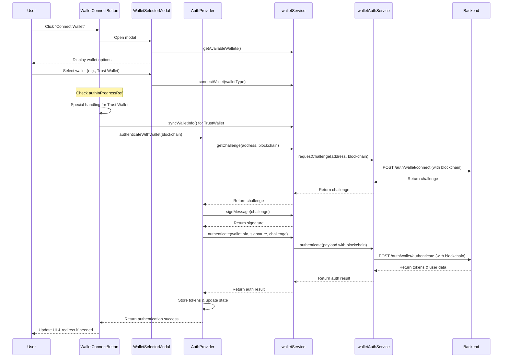

# Frontend Authentication Flow Documentation

## Overview

This document provides a consolidated view of the authentication flow in the frontend application, with special focus on wallet-based authentication and blockchain interaction. This documentation includes the latest fixes and optimizations, especially for cross-wallet compatibility issues.

## Core Files Structure

The authentication system is organized into several key components:

```
frontend/
├── src/
│   ├── components/
│   │   ├── WalletConnectButton.tsx         # Main UI component for wallet connection
│   │   └── wallet-selector/
│   │       ├── WalletSelectorModal.tsx      # Modal for selecting different wallet types
│   │       └── WalletSelector.tsx           # Component for displaying wallet options
│   ├── contexts/
│   │   ├── AuthProvider.tsx                # Authentication context provider
│   │   └── WalletProvider.tsx              # Wallet connection context provider
│   ├── services/
│   │   ├── wallet/
│   │   │   ├── walletExtensions.ts         # Extensions for wallet functionality
│   │   │   ├── walletService.ts            # Core wallet functionality service
│   │   │   ├── walletSelector.ts           # Service for handling wallet selection
│   │   │   ├── walletInitialization.ts     # Initialization of wallet providers
│   │   │   ├── extensions/                 # Wallet extension implementations
│   │   │   ├── providers/                  # Wallet provider implementations
│   │   │   └── core/
│   │   │       └── walletBase.ts           # Base interfaces and types for wallet integration
│   │   ├── api/
│   │   │   └── modules/
│   │   │       └── auth/
│   │   │           ├── wallet-auth-service.ts   # API service for wallet authentication
│   │   │           ├── auth-service.ts          # General authentication service
│   │   │           └── auth-service-bridge.ts   # Bridge between auth services
│   │   └── security/
│   │       └── modules/
│   │           └── device-fingerprint.ts   # Device fingerprinting for security
│   └── config/
│       └── blockchain/
│           └── constants.ts                # Blockchain configuration constants
```

## Authentication Flow

### 1. User Initiates Wallet Connection

The flow starts when a user clicks the "Connect Wallet" button rendered by `WalletConnectButton.tsx`:

1. The button click handler (`handleClick`) shows the wallet selector modal
2. `setModalOpen(true)` triggers the rendering of `WalletSelectorModal`

### 2. Wallet Selection

In the `WalletSelectorModal.tsx`:

1. Available wallets are fetched using `walletSelector.getAvailableWallets()`
2. When a user selects a wallet from the list, `handleSelectWallet` is called
3. `walletSelector.connectWallet(walletType)` is invoked to connect to the selected wallet
4. On successful connection, the result is passed to `onSelect` callback from `WalletConnectButton`

### 3. Wallet Connection Processing

Back in `WalletConnectButton.tsx`, the `handleWalletSelect` function:

1. Prevents duplicate authentication attempts using `authInProgressRef`
2. Processes the wallet connection result
3. For Trust Wallet, special handling is applied:
   - Forces blockchain type to Polygon (`BlockchainType.POLYGON`)
   - Checks network compatibility and attempts to switch to the correct network if needed
   - Adds extra delay for synchronization (`syncDelay`)
   - Manually syncs wallet info using `walletService.syncWalletInfo()`
   - Creates a sanitized wallet info object to prevent provider-related errors

### 4. Authentication Process

Once the wallet is connected, the authentication begins:

1. `authenticateWithWallet(effectiveBlockchain)` is called with the appropriate blockchain type parameter
2. The `AuthProvider.tsx` implements the authentication in several steps:
   
   a. **Challenge Request**: 
      - Calls `getAuthChallenge` which uses `walletService.getChallengeWithBlockchain()`
      - This invokes the backend API endpoint via `walletAuthService.requestChallenge()`
      - The blockchain parameter is properly normalized and included in the request
      - A debounce mechanism prevents multiple simultaneous requests
   
   b. **Message Signing**:
      - Signs the challenge using `signWalletChallenge` to get a cryptographic signature
      - The wallet's native signing capability is used through `walletService.signMessage()`
   
   c. **Backend Authentication**:
      - Calls `performBackendAuth` with:
         - Wallet info (address, blockchain type)
         - Signature
         - Challenge
         - Optional email and device fingerprint
      - `walletService.authenticate()` sends this data to the backend endpoint, including the blockchain type
   
   d. **Token Storage**:
      - On successful authentication, the backend returns tokens
      - These are stored securely using `secureStorage.setItem()`
      - Access token, refresh token, and device fingerprint are saved
   
   e. **Profile Fetching**:
      - After authentication, the user profile is fetched
      - `fetchUserProfileWithRetry` calls `profileService.getUserProfile()`
      - Profile completeness is determined based on available fields

### 5. Emergency Authentication Flow

If the standard flow fails due to missing wallet information, a fallback mechanism is implemented:

1. Check for wallet information in localStorage
2. If available, attempt authentication with the stored information
3. If successful, update the wallet state with the stored information
4. This ensures users can still authenticate even if wallet context is temporarily unavailable

### 6. Post-Authentication

After successful authentication:

1. UI is updated to display the connected wallet address
2. Optional callbacks are triggered (`onAuthenticated`)
3. Redirect may occur based on `redirectAfterAuth` prop

### 7. Error Handling

Throughout the flow, there are multiple error handling mechanisms:

1. Each step has try/catch blocks to capture errors
2. Authentication errors are tracked in the `authStage` state
3. Errors are displayed to the user via a Snackbar component
4. Debug information is logged to the console
5. For Trust Wallet specific errors, enhanced diagnostics are provided
6. Global `window.walletAuthDebug` object provides runtime debugging capabilities

## Trust Wallet Specific Issues & Solutions

Trust Wallet requires special handling due to some unique behaviors:

1. **Network Type Reporting**: Trust Wallet may not always report the correct blockchain network, so we force it to Polygon.

2. **Multiple Challenge Requests**: Trust Wallet authentication flow may trigger multiple challenge requests, leading to rate limiting errors.

3. **Blockchain Type Inconsistency**: Trust Wallet uses "polygon" as blockchain type which was causing a 400 Bad Request error.

4. **Solution Implemented**: 
   - Added normalized blockchain type parameter to backend requests
   - Implemented proper handling of blockchain parameter in `wallet-auth-service.ts`
   - Added debounce mechanism to prevent multiple challenge requests
   - Added reliable tracking of in-progress authentication with `authInProcessRef`
   - Added additional delay for wallet info synchronization
   - Use sanitized wallet info with explicit blockchain type for Trust Wallet

## Key Implementation Details

### Blockchain Type Normalization

```typescript
// From src/config/blockchain/constants.ts
export const normalizeBlockchainType = (type: string | undefined): BlockchainType => {
  if (!type) {
    return DEFAULT_BLOCKCHAIN_NETWORK;
  }

  const normalized = type.toLowerCase();
  
  // Special case handling for Trust Wallet which might report "ethereum" even on Polygon
  if (normalized === 'ethereum') {
    // If we're on chain ID 137, it's actually Polygon
    if (typeof window !== 'undefined' && window?.ethereum?.chainId === CHAIN_IDS[BlockchainType.POLYGON]) {
      return BlockchainType.POLYGON;
    }
  }

  // Check if it's a valid blockchain type
  const validType = Object.values(BlockchainType).find(
    (val) => val.toLowerCase() === normalized
  );

  return validType || DEFAULT_BLOCKCHAIN_NETWORK;
};
```

### Challenge Request with Blockchain Parameter

```typescript
// From src/services/api/modules/auth/wallet-auth-service.ts
public async requestChallenge(walletAddress: string, blockchain?: string): Promise<WalletChallenge> {
  try {
    console.log(`[Wallet Auth] Requesting challenge for address: ${walletAddress}, blockchain: ${blockchain || 'default'}`);
    
    if (!walletAddress) {
      throw new Error('Wallet address is required');
    }
    
    // Normalize the wallet address based on blockchain type
    const formattedAddress = this.normalizeWalletAddress(walletAddress, blockchain);
    
    // Use a consistent blockchain type internally and send normalized blockchain type
    const requestData: Record<string, string> = { 
      address: formattedAddress,
      walletAddress: formattedAddress
    };
    
    // Add blockchain only if it's provided and not empty
    if (blockchain) {
      // Convert to lowercase for consistency
      requestData.blockchain = blockchain.toLowerCase();
    }
    
    const response = await this.client.post<WalletChallenge>(
      '/auth/wallet/connect',
      requestData
    );
    
    return response.data;
  } catch (error) {
    // Error handling...
  }
}
```

### Trust Wallet Specific Handling

```typescript
// From src/components/WalletConnectButton.tsx
if (isTrustWallet) {
  console.log('Trust Wallet detected - preparing for authentication with enhanced checks');
  
  // For Trust Wallet, manually sync the wallet info to ensure it's available
  if (walletService.syncWalletInfo && typeof walletService.syncWalletInfo === 'function') {
    try {
      // Create a sanitized wallet info object that won't trigger the provider.toLowerCase error
      const safeWalletInfo = {
        address: result.walletInfo.address,
        blockchain: BlockchainType.POLYGON,
        chainId: 137, // Polygon chain ID
        providerType: WalletProviderType.TRUST,
        // Explicitly omit provider, which causes the error with toLowerCase
      };
      
      console.log('Manually syncing wallet info for', safeWalletInfo.address);
      await walletService.syncWalletInfo(safeWalletInfo);
    } catch (syncError) {
      console.error('Error syncing wallet info:', syncError);
    }
  }
}
```

## Authentication Sequence Diagram



## Best Practices & Recommendations

1. **Always Include Blockchain Type**: Always include the normalized blockchain type parameter in authentication requests for cross-wallet compatibility.

2. **Normalize Blockchain Types**: Use `normalizeBlockchainType()` when handling blockchain types from external sources.

3. **Prevent Duplicate Authentication**: Use reference flags like `authInProgressRef` to prevent multiple simultaneous authentication attempts.

4. **Special Wallet Handling**: Implement wallet-specific adaptations (as seen with Trust Wallet) based on their unique behaviors.

5. **Consistent Error Handling**: Use consistent error handling patterns and meaningful error messages.

6. **Testing**:
   - Test with different wallet providers (MetaMask, Trust Wallet, etc.)
   - Verify authentication with different blockchain types
   - Test the emergency fallback mechanism
   - Verify error handling for common failure scenarios

7. **Monitoring**:
   - Log relevant authentication details for debugging
   - Use the global debug object (`window.walletAuthDebug`) for runtime diagnostics
   - Track failed authentication attempts by wallet type

## Conclusion

The authentication flow for wallet-based login has been enhanced to properly handle different wallet providers, with special attention to Trust Wallet compatibility. By consistently normalizing and passing blockchain type parameters, we ensure reliable authentication across different wallet providers and blockchain networks.
